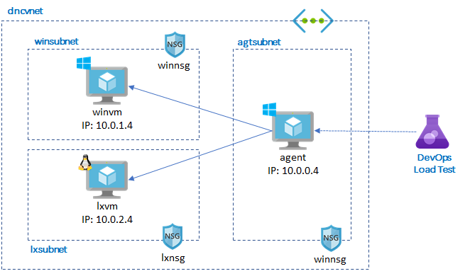

# Create a testing environment



VM Configuration

- Target VMs:
    - D2s_v3 (2 cores/8 GB) on Windows Server (Core+Docker) 1803
    - D2s_v3 (2 cores/8 GB) on Ubuntu 16.04 LTS
- Agent VM:
    - D4s_v3 (4 cores/16 GB ) + SSD 256 GB, Windows Server 2012R2 Datacenter

## 1. Create a resource group and VNET

Open [Azure Cloud Shell](https://docs.microsoft.com/en-us/azure/cloud-shell/overview) in Azure portal and run following script.

```
rg=test-dnc
vnet=dncvnet

az group create -n $rg -l koreacentral
az network vnet create -g $rg -n $vnet --address-prefix 10.0.0.0/16 \
            --subnet-name agtsubnet --subnet-prefix 10.0.0.0/24
az network vnet subnet create -g $rg --vnet-name $vnet -n winsubnet --address-prefix 10.0.1.0/24
az network vnet subnet create -g $rg --vnet-name $vnet -n lxsubnet --address-prefix 10.0.2.0/24
```

## 2. Provision Target VMs

Templates are located in [`azure/template`](./azure/template).

Update `adminUsername` and `adminPassword` in `*vm.parameters.json` before running the cli

```
az group deployment create -g $rg -n dncwin --template-file winvm.json --parameters @winvm.parameters.json

az group deployment create -g $rg -n dnclx --template-file lxvm.json --parameters @lxvm.parameters.json
```

Windows template is modified from [https://github.com/Azure/azure-quickstart-templates/tree/master/201-vm-winrm-windows/](https://github.com/Azure/azure-quickstart-templates/tree/master/201-vm-winrm-windows/). Windows VM is configured WINRM for remote access via PowerShell.

## 3. Provision Agent VM

Update `adminUsername`, `adminPassword`, `azureDevOpsServicesAccount`, `personalAccessToken` in [agent.parameters.json](./azure/template/agent.parameters.json) before running the cli

To get PAT(Personal Access Token) of Azure DevOps, go to top right user(icon)->security->PAT->New Token->Show all scope->Select Load test

```
az group deployment create -g $rg -n dncagt --template-file agent.json --parameters @agent.parameters.json
```

This template is modified from [https://github.com/Azure/azure-quickstart-templates/tree/master/201-vsts-cloudloadtest-rig-existing-vnet](https://github.com/Azure/azure-quickstart-templates/tree/master/201-vsts-cloudloadtest-rig-existing-vnet)

> Note: When running load test, use warm-up or step and configure agent VMs correctly (recommend high performance VM and disks). Performance may be bottle necked by performance of agent VMs. Make sure that agent VM does not have any performance issue, such as disk IOPS.

Reference: https://blogs.msdn.microsoft.com/devops/2016/09/27/run-cloud-based-load-tests-using-your-own-machines-a-k-a-bring-your-own-subscription/

## 4. Install runtime

### Windows VM

Connect Windows VM via RDP or WinRM and run following powershell script. Note that you have to install by non-gui method on Windows Server Core.

```
# Install IIS
Install-WindowsFeature Web-Server,Web-Asp-Net45,NET-Framework-Features

# https://docs.microsoft.com/en-us/aspnet/core/host-and-deploy/iis/?view=aspnetcore-2.2
Invoke-WebRequest https://download.visualstudio.microsoft.com/download/pr/48adfc75-bce7-4621-ae7a-5f3c4cf4fc1f/9a8e07173697581a6ada4bf04c845a05/dotnet-hosting-2.2.0-win.exe -outfile $env:temp\dotnet-hosting-2.2.0-win.exe 
Start-Process $env:temp\dotnet-hosting-2.2.0-win.exe  -ArgumentList '/quiet' -Wait

# Restart the web server so that system PATH updates take effect
net stop was /y
net start w3svc
```

### Linux VM

Connect Linux VM via ssh and run the script.

```
wget -q https://packages.microsoft.com/config/ubuntu/16.04/packages-microsoft-prod.deb
sudo dpkg -i packages-microsoft-prod.deb

sudo apt-get install apt-transport-https
sudo apt-get update
sudo apt-get install aspnetcore-runtime-2.2
```

Read more info at https://dotnet.microsoft.com/download/linux-package-manager/ubuntu16-04/runtime-current

You also need to install Nginx, Docker CE engine and other utils.

```
sudo apt install -y nginx
sudo apt install -y docker.io
sudo apt install -y zip
```

To avoid docker permission issue, run following script and re-login VM.

```
sudo usermod -a -G docker $USER
```