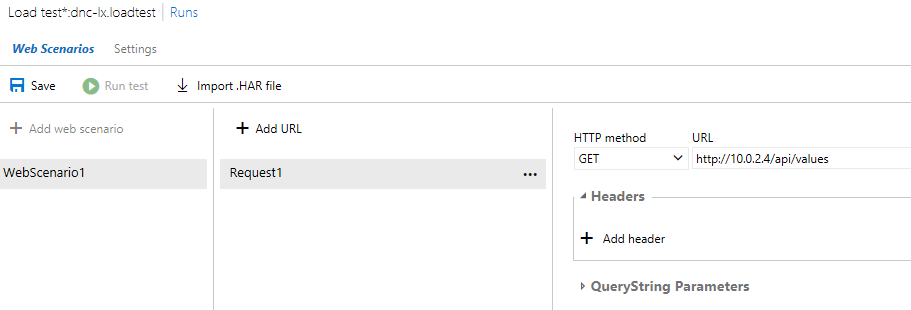
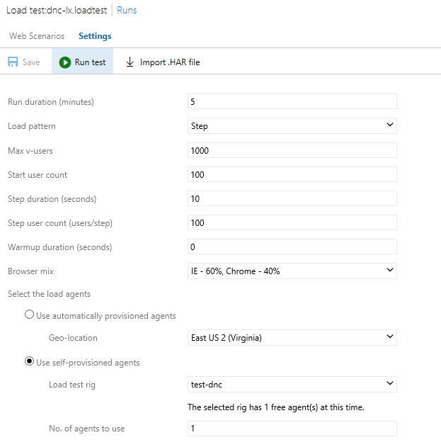
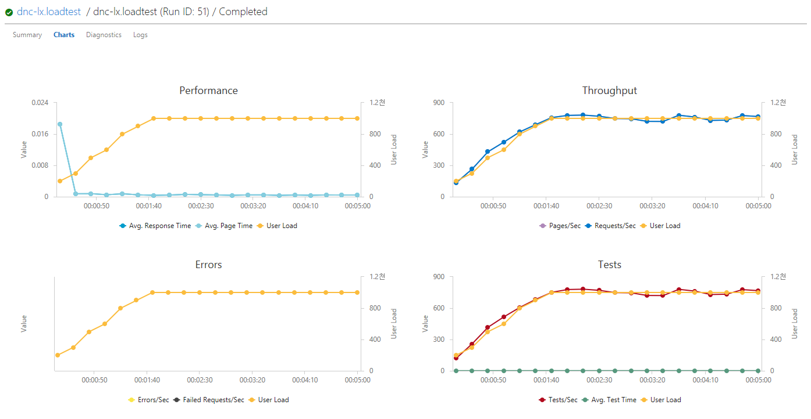

# Load Test

## Setup Load Test

Open your `Azure DevOps` then move to `Test Plan -> Load Test`.

Click '+ New' and 'URL based test'

On _Web Senarios_ section, add URL.



- HTTP methods: `GET`
- URL:  `http://10.0.2.4/api/values`

On _Settings_, configure as follows.



- Run duration (minutes): `5`
- Load pattern: `Step`
- Max v-users: `1000`
- Start user count: `100`
- Step user count (users/step): `100`
- Select the load agents: `Use self-privisioned agensts`
    - Load test rig: `test-dnc`
    - No. of agents to use: `1`

## Run Load Test

Click _> Run test_ to start load test.

Record 'Response Time' 'RPS' and 'CPU' of target VM for each test options. You measure CPU from Azure Portal.

## Results



Following is the simple test results for various host/deploy options. Note that this test result is intended for *very* rough performance comparison between various options.

```
Id | Opt | OS      | HTTP Server | Proxy/Docker      | Avg RT(ms) | Avg RPS | CPU Util
---|-----|---------|-------------|-------------------|------------|---------|---------
56 | 1   | Windows | IIS         | In-proc           | 0.4        | 708.8   | 29.15%
58 | 2   | Windows | Kestrel     | IIS (out-of proc) | 4.3        | 714.8   | 39.63%
59 | 3   | Windows | Kestrel     | -                 | 0.3        | 715.8   | 22.67%
60 | 4   | Windows | Http.sys    | -                 | 0.5        | 725.5   | 27.80%
61 | 5   | Windows | Kestrel     | Docker            | 1.3        | 717.3   | 39.75%
52 | 6   | Linux*  | Kestrel     | Nginx             | 461.4      | 575.1   | 80%
51 | 7   | Linux   | Kestrel     | -                 | 0.7        | 662     | 20.1%
53 | 8   | Linux   | Kestrel     | Docker            | 6.6        | 703.8   | 75.9%
```

Note *:
 - Failed Request starts to appear from 800 users load.
 - 26% of failed requests of total 172,518 request.
 - Mostly 502 BadGateway errors and few SocketException errors are produced during test.

## Update for Linux+Nginx options

Using unix socket (using libuv) between Nginx and dotnet improved performance.

```
Id | Opt | OS      | HTTP Server | Proxy/Docker      | Avg RT(ms) | Avg RPS | Avg CPU | Note 
---|-----|---------|-------------|-------------------|------------|---------|---------|---------------
63 | 6   | Linux   | Kestrel     | Nginx             | 0.9        | 715.3   | 33.85%  | Use Unix socket
```

Please refer [this link](./6_unixsocket.md) to how to configure unix socket.

## Comment

- It seems that ASP.NET Core performs better in Windows Server than Linux.
- Both IIS+In-proc(Kestrel) and Self-hosted(Kestrel) options performed well at lower CPU utilization.
- Tested several load tests under the same condition but _Linux+docker_ option comsumed high CPU utilization (75~80%) than any other options.